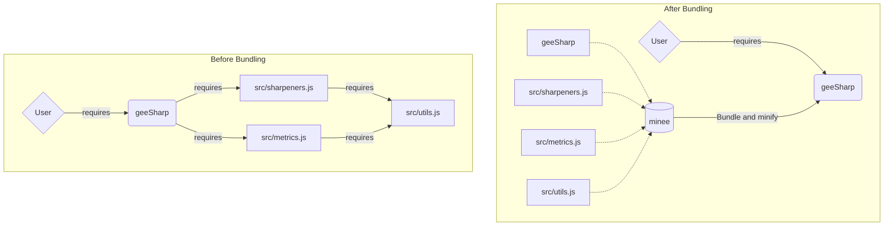

# minee 📦

[](https://badge.fury.io/js/minee)

`minee` is a module bundler for Earth Engine. It takes a module that may contain multiple imported scripts and bundles them into a single compact file for users to import. 


The diagrams below illustrate bundling with an example module, [geeSharp](https://github.com/aazuspan/geeSharp.js). Before bundling, a user requires the entry module `geeSharp` which requires a network of dependencies. Each `require` call takes time to resolve, leading to slow imports. After bundling, a user imports a single entry file that was pre-bundled by `minee`, reducing file size and import time by [about 70%](#example-results).


# Setup

## Installation

Download [Node.js](https://nodejs.org/en/download/), then install `minee` globally with:

```bash
npm install -g minee
```

## Authentication

If you haven't accessed an Earth Engine repository using `git` from your computer before, you'll need to authenticate first by going to https://earthengine.googlesource.com/new-password and following the instructions. This will store credentials on your computer at `~/.gitcookies` that allows `minee` to grab and bundle repositories.

# Usage

## CLI

```bash
Usage: minee [options]

📦 Earth Engine module bundler.

Options:
  -V, --version       output the version number
  -e, --entry <path>  The path to the module entry point, e.g. users/username/repository:module.
  -d --dest <path>    The local file path to write the bundled file.
  --no-minify         Skip minifying code after bundling.
  --no-header         Drop header information from the bundled file.
  --keep-names        Avoid changing internal variable names when minifying.
  -h, --help          display help for command
```

Pass an Earth Engine module path to the `minee` command, with an optional destination path to save the bundled module. For example, the following command...

```bash
minee --entry=users/aazuspan/geeSharp:geeSharp --dest=./bundled --keep-names
```

...will download the `users/aazuspan/geeSharp` repository, find any modules required through the `geeSharp` module, bundle them into a single file, and save that to `./bundled`.

### Configuration File

To avoid entering CLI options every time `minee` is run, you can create a `.minee.json` configuration file in the root of your project where you run `minee`.

The following options are supported:

| name | type | default | description |
|---|---|---|---|
| entry | string |  | Entry path to the Earth Engine module, e.g. `users/username/repo:module` |
| dest | string |  | Optional local path to write the bundled file. If none is provided, `<entry>.bundled.js` will be used. |
| header | boolean | true | If `true`, a descriptive header is included in the bundled file. |
| minify | boolean | true | If `true`, the bundle is minified to reduce file size. |
| keepNames | boolean | false | If `true`, all identifiers are preserved in the bundled source code when minifying. This option has no effect on functionality, but makes the bundled code easier to read and debug at the cost of larger file size.  |

Below is an example configuration file:

```javascript
/* .minee.json */
{
  "entry": "users/aazuspan/geeSharp:geeSharp",
  "dest": "./bundled",
  "keepNames": true
}
```

Now running `minee` with no options will produce the same results as before. `minee` prioritizes CLI options over configuration options, so you can override the configuration file by passing options as needed.

## JavaScript API

The [documentation](https://aazuspan.github.io/minee/) provides detailed info on the API, but the sections below give a quick guide to get started.

### Bundling a Module

You can use the [`bundleModule`](https://aazuspan.github.io/minee/functions/bundleModule.html) function to bundle an Earth Engine module through the JavaScript API.

```javascript
import { bundleModule } from "minee";

// Load and bundle a module from an entry script
const bundled = await bundleModule("users/aazuspan/geeSharp:geeSharp", {keepNames: true});
```

This returns a [Bundle](https://aazuspan.github.io/minee/classes/Bundle.html) object that contains the bundled source code and other properties. Use the [`Bundle.write`](https://aazuspan.github.io/minee/classes/Bundle.html#write) method to save the bundled source code to a local file.

```javascript
bundled.write('./bundled.js');
```

### Loading a Module

For more control or to use `minee` outside of bundling, you may want to directly load modules with the [`loadModule`](https://aazuspan.github.io/minee/functions/loadModule.html) function.


```javascript
import { loadModule } from "minee";

// Define an entry point to the module
const url = "users/aazuspan/geeSharp:geeSharp";
// Load the module and return a Module object.
const geesharp = await loadModule(url, {showProgress: true});
```

After cloning any remote repositories, this returns a [Module](https://aazuspan.github.io/minee/classes/Module.html) object that contains information about the requested module and any modules that were required by it.

## Bundling an Existing Module

If you have an existing module that you want to bundle, the easiest way is to bundle the current entry module, rename that module, and copy-paste the bundled module to replace the old entry module.

Here's an example workflow using a module called `users/johnnyjackson/eetools:tools`:

1. Rename the `tools` module to `entry` in the Code Editor.
2. Run `minee -e users/johnnyjackson/eetools:entry -d ./tools`.
3. Copy the contents of `./tools` into a new Earth Engine script called `tools`.

Existing code built on your module will now automatically require the bundled version!

> **Note**
> Whenever you make changes to modules in your bundled module, you will have to re-bundle it! Using a Git workflow where you make changes locally and push them to Earth Engine (instead of manually copying and pasting) can simplify that process.

## Example Results

I checked file size and import time before and after bundling several different Earth Engine modules to demonstrate possible speed-ups. Import times represent the best cumulative time over three trials using the default CLI options.

| Module             | File Size | Import time |
|--------------------|:---------:|:-----------:|
| [fitoprincipe/batch](https://github.com/fitoprincipe/geetools-code-editor) |   -46.1%  |    -74.7%   |
| [aazuspan/geeSharp](https://github.com/aazuspan/geeSharp.js) | -75.4% | -68.8% |
| [gena/palettes](https://github.com/gee-community/ee-palettes)      |   -16.9%  |    -63.5%   |
| [dmlmont/spectral](https://github.com/davemlz/spectral)   |   -44.1%  |    -48.0%   |
| [jstnbraaten/msslib](https://github.com/gee-community/msslib) |   -78.5%  |    -19.2%   |

As you can see, the level of improvement varies by module. Modules with lots of documentation show the greatest reduction in file size, while modules with complex file structures show the greatest reduction in import times.

> **Warning**
> Bundling adds some additional boilerplate code, so file sizes and import times *can* increase for simple, single-file modules.

# Legal Disclaimer

Any modules required through your entry module, including those by other authors, will be bundled into your source code file. Please check the license of any included module before distributing the bundled file. For convenience, `minee` includes a header comment listing the path of all scripts used in the bundle and any licenses marked with a `@license` tag.
