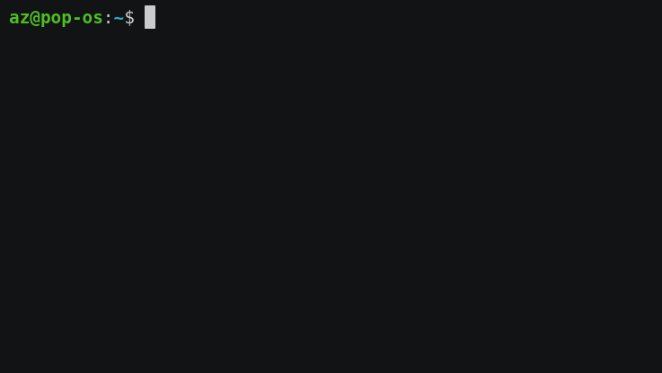
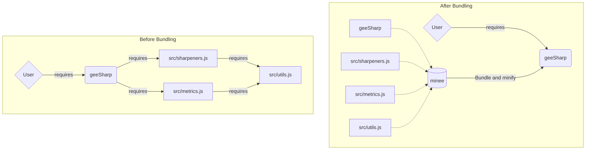

# minee 📦

`minee` is a module bundler for Earth Engine. It takes a module that may contain multiple imported scripts and bundles them into a single compact file for users to import. 



The diagrams below illustrate bundling with an example module, [geeSharp](https://github.com/aazuspan/geeSharp.js). Before bundling, a user requires the entry module `geeSharp` which requires a network of dependencies. Each `require` call takes time to resolve, leading to slow imports. After bundling, a user imports a single entry file that was pre-bundled by `minee`, reducing file size and import time by [about 70%](#example-results).


## Setup

### Installation

Download [Node.js](https://nodejs.org/en/download/), then install `minee` globally with:

```bash
npm install -g minee
```

### Authentication

If you haven't accessed an Earth Engine repository using `git` from your computer before, you'll need to authenticate first by going to https://earthengine.googlesource.com/new-password and following the instructions. This will store credentials on your computer at `~/.gitcookies` that allows `minee` to grab and bundle repositories.

## Usage

### CLI

```bash
Usage: minee [options] <entry>

📦 Earth Engine module bundler.

Options:
  -V, --version      output the version number
  -d, --dest <path>  The local file path to write the bundled module.
  --no-header        Drop header information from the bundled file
  -h, --help         display help for command
```

Pass an Earth Engine module path to the `minee` command, with an optional destination path to save the bundled module. For example, the following command...

```bash
minee users/aazuspan/geeSharp:geeSharp --dest=./bundled
```

...will download the `users/aazuspan/geeSharp` repository, find any modules required through the `geeSharp` module, bundle them into a single file, and save that to `./bundled`.

### JavaScript API

#### Bundling a Module

You can use the `bundleModule` function to bundle an Earth Engine module through the JavaScript API.

```javascript
import { bundleModule } from "minee";

// Define an entry point to the module
const url = "users/aazuspan/geeSharp:geeSharp";
// Choose an output path to save the bundled module locally
const dest = "./bundled.js";

// Load, bundle, and export the module
const bundled = await bundleModule(url, dest);
```

The `bundleModule` function saves the bundled module locally, but it also returns a `Bundle` object that you can use to access the bundled data through the `code`, `entry`, `modules`, and `dependencyTree` properties. For example:

```javascript
// Get the bundled source code that includes all of the required modules
>>> bundled.code
"var modules={ /* ... */ }" 

// Get the path of all modules bundled within the entry module
>>> bundled.modules.map((module) => module.path);
[
  'users/aazuspan/geeSharp:geeSharp',
  'users/aazuspan/geeSharp:src/sharpeners.js',
  'users/aazuspan/geeSharp:src/metrics.js',
  'users/aazuspan/geeSharp:src/utils.js'
]

// Get the dependency tree for the imported module
>>> bundled.dependencyTree();
`
┗ users/aazuspan/geeSharp:geeSharp (#16ed867)
 ┣ users/aazuspan/geeSharp:src/sharpeners.js (#831f9f4)
 ┃┗ users/aazuspan/geeSharp:src/utils.js (#f56281e)
 ┗ users/aazuspan/geeSharp:src/metrics.js (#626188d)
  ┗ users/aazuspan/geeSharp:src/utils.js (#f56281e)
`
```


#### Loading a Module

For more control or to use `minee` outside of bundling, you may want to directly load modules with the `loadModule` function.

```javascript
import { loadModule } from "minee";

// Define an entry point to the module
const url = "users/aazuspan/geeSharp:geeSharp";
// Load the module and return a Module object.
const geesharp = await loadModule(url, {showProgress: true});
```

The `loadModule` function takes an `options` object where you can define the following:
- `showProgress` - If `true`, a spinner will display progress when cloning repositories. Defaults to `true`.
- `loadDependencies` - If `true`, all downstream dependencies required through the module (including from external repositories) will be loaded recursively, allowing you to access them thorugh the `dependencies` property. Defaults to `true`.
- `allowCircular` - If `true`, circular dependencies which would break Earth Engine imports are ignored. Defaults to `false`.

Once a module is loaded, you can access various properties such as the module's `path`, `code`, `ast`, `commit`, `license`, or `dependencyTree`. If `loadDependencies` was not set to `false`, you can access depended modules through `dependencies`. For example:

```javascript
// Get the abstract syntax tree of the module source code.
>>> geesharp.ast.program.body[0]
Node { type: "VariableDeclaration", /* ... */ } 

// Get the commit hash of the loaded version.
>>> geesharp.commit;
"16ed867"

// Get the path of the module's first dependency.
>>> geesharp.dependencies[0].path;
"users/aazuspan/geeSharp:src/sharpeners.js"

// Get the path of the module's first dependency's first dependency.
>>> geesharp.dependencies[0].dependencies[0].path;
"users/aazuspan/geeSharp:src/utils.js"
```

### Bundling an Existing Module

If you have an existing module that you want to bundle, the easiest way is to bundle the current entry module, rename that module, and copy-paste the bundled module to replace the old entry module.

Here's an example workflow using a module called `users/johnnyjackson/eetools:tools`:

1. Rename the `tools` module to `entry` in the Code Editor.
2. Run `minee users/johnnyjackson/eetools:entry --dest=./tools`.
3. Copy the contents of `./tools` into a new Earth Engine module called `tools`.

Existing code built on your module will now automatically require the bundled version!

> **Note**
> Whenever you make changes to modules in your bundled module, you will have to re-bundle it! Using a Git workflow where you make changes locally and push them to Earth Engine (instead of manually copying and pasting) can simplify that process.

## Example Results

I checked file size and import time before and after bundling several different Earth Engine modules to demonstrate possible speed-ups. Import times represent the best cumulative time over three trials.

| Module             | File Size | Import time |
|--------------------|:---------:|:-----------:|
| [fitoprincipe/batch](https://github.com/fitoprincipe/geetools-code-editor) |   -46.1%  |    -74.7%   |
| [aazuspan/geeSharp](https://github.com/aazuspan/geeSharp.js) | -75.4% | -68.8% |
| [gena/palettes](https://github.com/gee-community/ee-palettes)      |   -16.9%  |    -63.5%   |
| [dmlmont/spectral](https://github.com/davemlz/spectral)   |   -44.1%  |    -48.0%   |
| [jstnbraaten/msslib](https://github.com/gee-community/msslib) |   -78.5%  |    -19.2%   |

As you can see, the level of improvement varies by module. Modules with lots of documentation show the greatest reduction in file size, while modules with complex file structures show the greatest reduction in import times.

> **Warning**
> Bundling adds some additional boilerplate code, so file sizes and import times *can* increase for simple, single-file modules.

## Legal Disclaimer

Any modules required through your entry module, including those by other authors, will be bundled into your source code file. Please check the license of any included module before distributing the bundled file. For convenience, `minee` includes a header comment listing the path of all scripts used in the bundle and any licenses marked with a `@license` tag.
